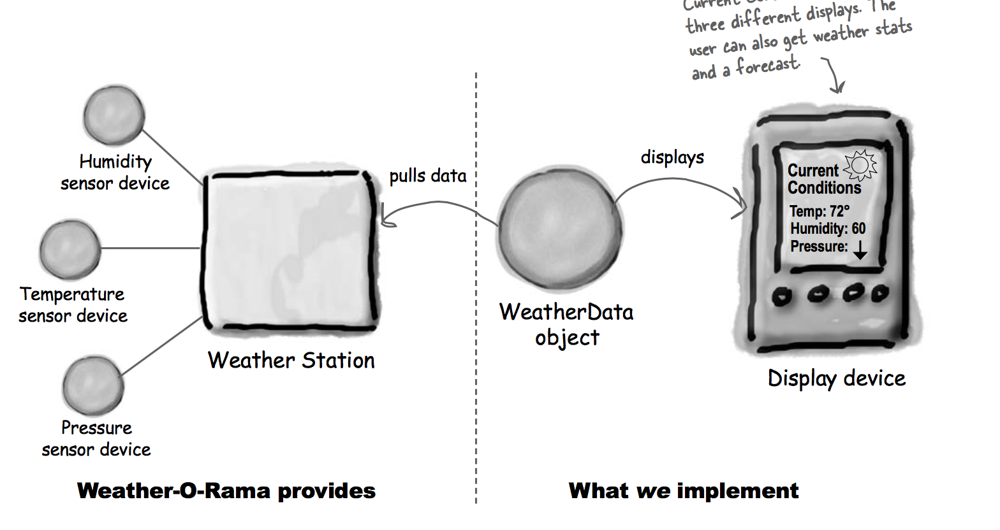
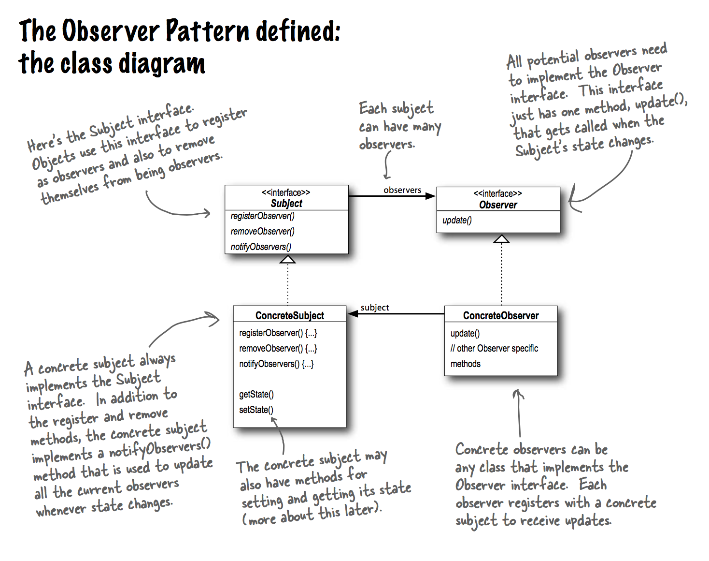
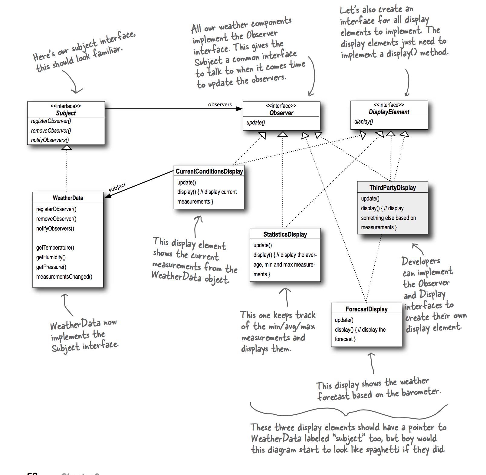
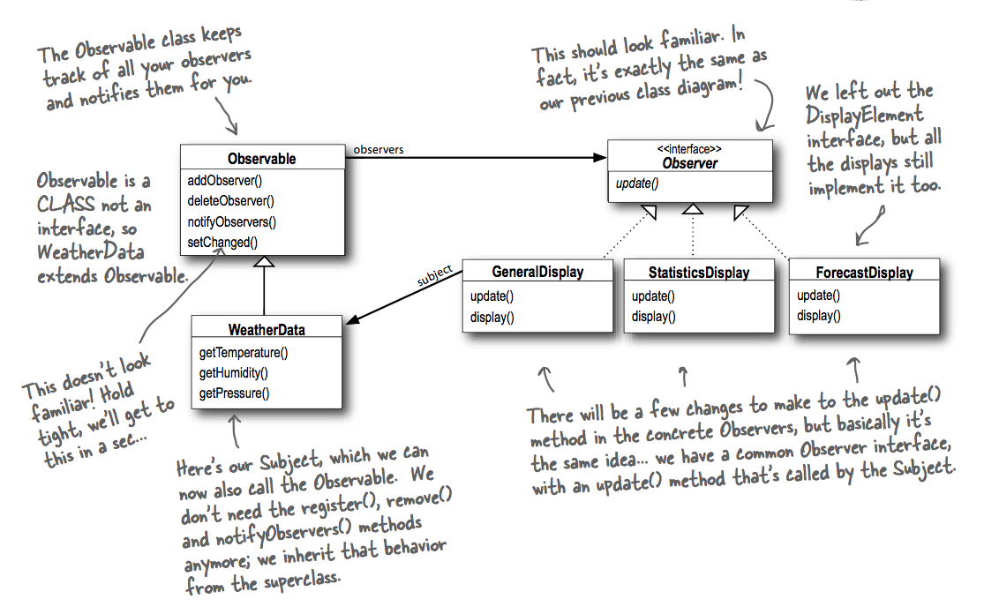

### Observer Graph

Overview of the components

### UML

Overview

Implement with own observable/observer interface

Implement with java's observable/observer interface

### Definition

The Observer Pattern defines a one-to-many dependency between objects so that when one object changes state, all of its dependents are notified and updated automatically.

### Example from newspaper or magazine subscriptions

A newspaper publisher goes into business and begins publishing newspapers.
You subscribe to a particular publisher, and every time there’s a new edition it gets delivered to you. As long as you remain a subscriber, you get new newspapers.

You unsubscribe when you don’t want papers anymore, and they stop being delivered.

While the publisher remains in business, people, hotels, airlines and other businesses constantly subscribe and unsubscribe to the newspaper.

**Publishers + Subscribers = Observer Pattern**

If you understand newspaper subscriptions, you pretty much understand the Observer Pattern, only we call the publisher the SUBJECT and the subscribers the OBSERVERS.

### The power of Loose Coupling

When two objects are loosely coupled, they can interact, but have very little knowledge of each other.

The Observer Pattern provides an object design where subjects and observers are loosely coupled.

### Push vs Pull

Just let us come to you to get the state we need. That way, if some of us only need a little bit of state, we aren’t forced to get it all. It also makes things easier to modify later. Say, for example, you expand yourself and add some more state, well if you use pull, you don’t have to go around and change the update calls on every observer, you just need to change yourself to allow more getter methods to access our additional state.
