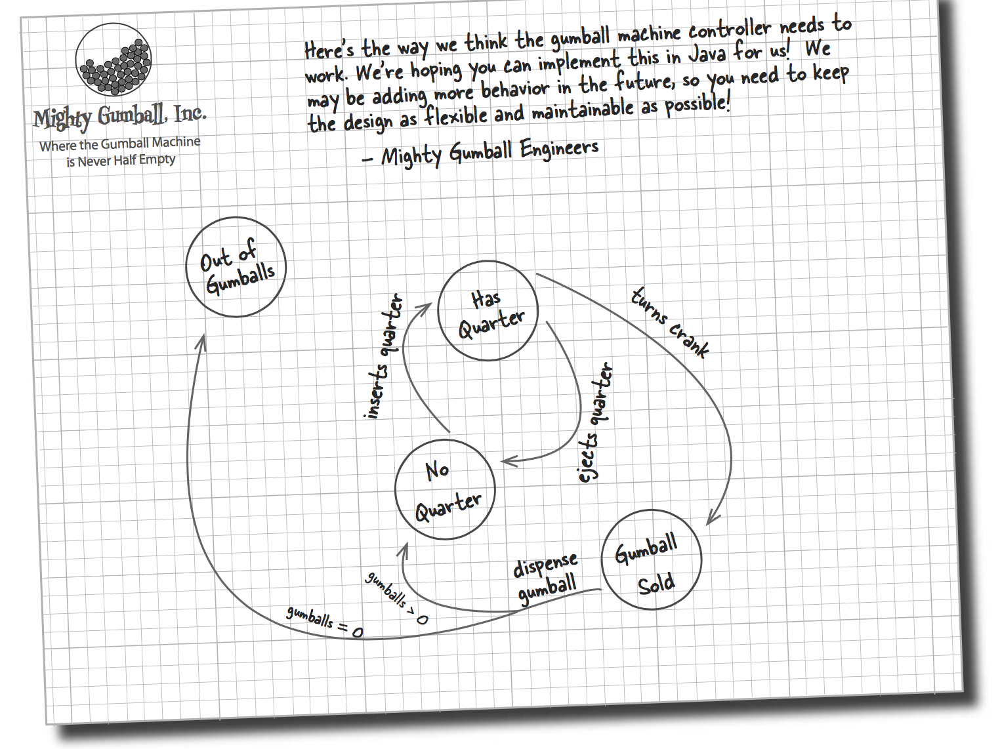
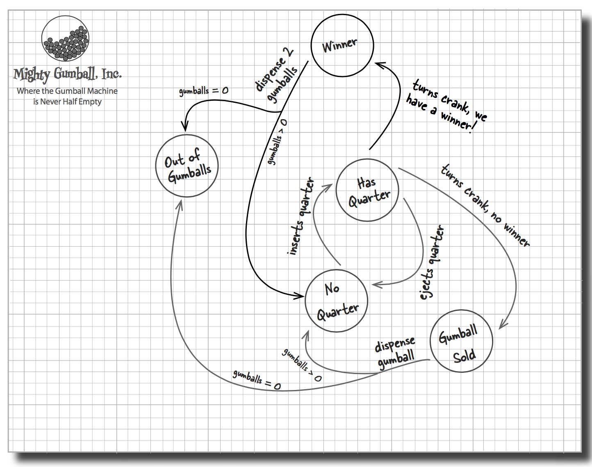
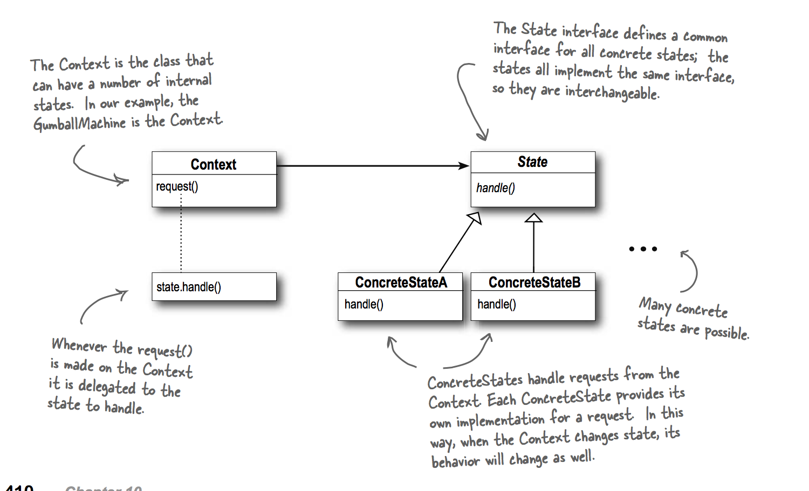
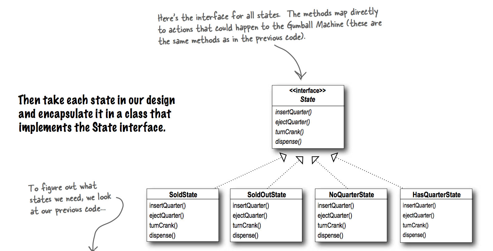

### State Graph

Sate graph

Adding winner state

### UML

Overview

Implement of state interface

### Strategy vs State

As you know, the Strategy Pattern went on to create a wildly successful business around interchangeable algorithms. State, however, took the perhaps more noble path of helping objects to control their behavior by changing their internal state.

### State Pattern Definition

The State Pattern allows an object to alter its behavior when its internal state changes. The object will appear to change its class.

Because the pattern encapsulates state into separate classes and delegates to the object representing the current state, we know that behavior changes along with the internal state.

What does it mean for an object to “appear to change its class?” Think about it from the perspective of a client: if an object you’re using can completely change its behavior, then it appears to you that the object is actually instantiated from another class. In reality, however, you know that we are using composition to give the appearance of a class change by simply referencing different state objects.
