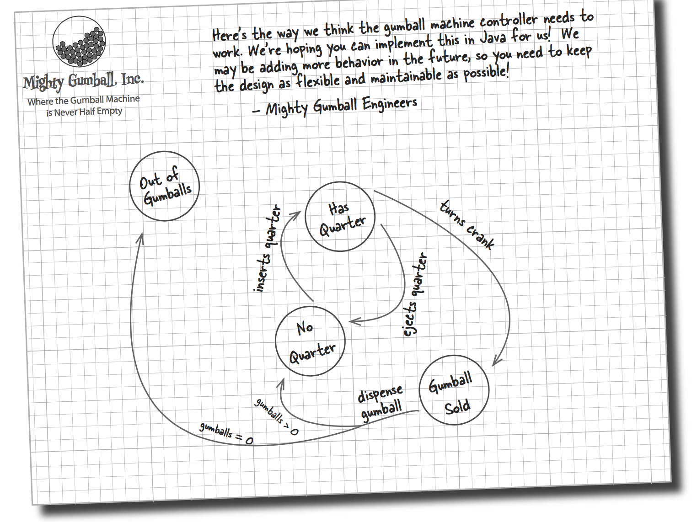
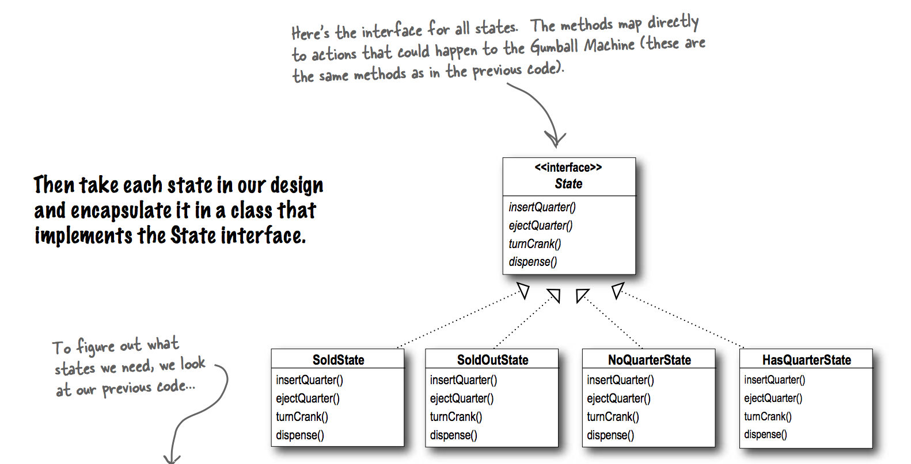

### State Graph

### UML

### Strategy vs State

As you know, the Strategy Pattern went on to create a wildly successful business around interchangeable algorithms. State, however, took the perhaps more noble path of helping objects to control their behavior by changing their internal state.
