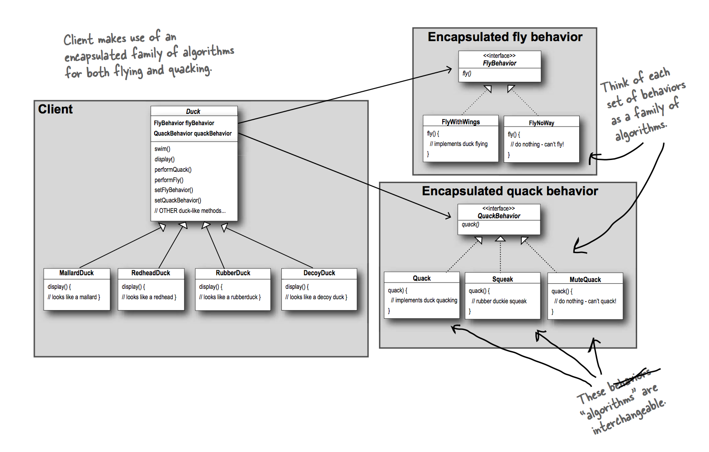

### UML

### Composition

Each duck has a FlyBehavior and a QuackBehavior to which it delegates flying and quacking.

When you put two classes together like this you’re using composition. Instead of inheriting their behavior, the ducks get their behavior by being composed with the right behavior object.

### Strategy Pattern Definition

Defines a family of algorithms, encapsulates each one, and makes them interchangeable. Strategy lets the algorithm vary independently from clients that use it.
